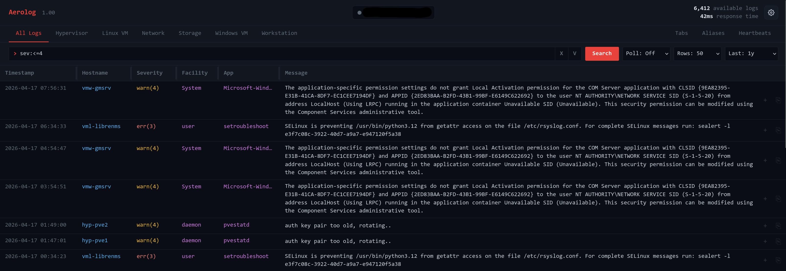
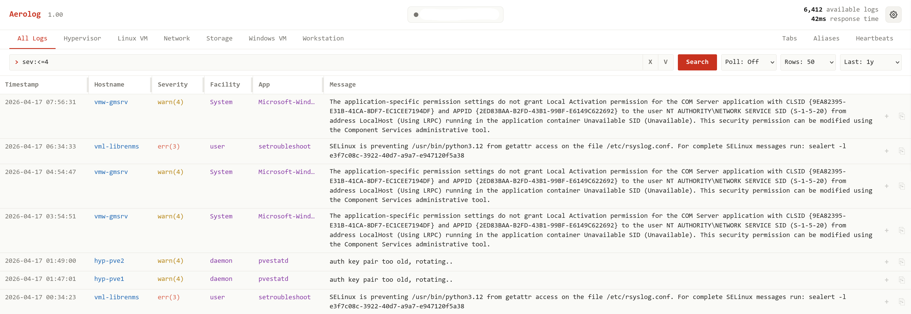

# Aerolog

Aerolog is a lightweight browser frontend for VictoriaLogs. It keeps the footprint small, stays browser-only, and focuses on making day-to-day log browsing less annoying.

This project is vibe coded. Most of the heavy lifting was done by LLMs, with human oversight, testing, and a lot of telling the machine to stop being clever.

Screenshots:

**Dark Mode**



**Light Mode**



## Quickstart

1. Clone the repository or download a release.
2. Open `site/index.html` in a browser.
3. Click the gear icon and set the **Server URL** to your VictoriaLogs instance (e.g. `logs-box:9428`).
4. Logs appear in the table. Use tabs, aliases, and search to filter.
5. It is recommended that you place Aerolog on the same system that runs VictoriaLogs. Both should be behind a reverse proxy with basic auth, but it is not strictly required.

No build step, no backend, no dependencies.

## What Aerolog is

Aerolog talks directly to VictoriaLogs and gives you a cleaner UI for browsing logs. It is not trying to replace VictoriaLogs, and it is not trying to become a full observability platform. It is a fast, local-state log viewer with a few focused conveniences layered on top.

Aerolog is primarily meant for Linux syslog and Windows Event Logs workflows. If VMUI already does everything you need, great. If you want tabs, aliases, query history, and friendlier search sugar for common day-to-day browsing, that is where Aerolog fits. More advanced VictoriaLogs requests should still be handled in VictoriaLogs VMUI or other methods.

## What Aerolog adds

Aerolog is not reinventing logging. It is trying to make common filtering and browsing tasks faster and less tedious.

Current differentiators include:

- **Tabs for host-based filtering.** Build named tabs around groups of devices so you can jump straight to a slice of your environment.
- **Hostname aliases.** Map ugly hostnames or IP-based names to something sane and readable.
- **Alias-aware searching.** Friendly names work in tab definitions and host searches.
- **Click-to-filter log fields.** Click structured log values to include or exclude them from the current search.
- **Query history.** Recent searches live directly in the search box, with pinned and startup-default entries for the searches you reuse.
- **Heartbeats.** See which hosts have sent logs in the selected time range, how many messages they sent, and when they were last seen.
- **Config backup and restore.** Export your local settings to JSON and import them elsewhere.

## What Aerolog is not

Aerolog is intentionally small in scope.

- It does **not** ingest logs. You still need rsyslog, syslog-ng, vector, fluent-bit, or whatever else you use to ship logs into VictoriaLogs.
- It does **not** do alerting. Use vmalert or another alerting tool for that.
- It does **not** do authentication. Put it behind nginx, vmauth, a VPN, or whatever access control you already trust.
- It does **not** have a backend. Everything lives in the browser. Settings persist in localStorage. There is no server-side state.

## Setup

Once VictoriaLogs is running and reachable from your browser, open Aerolog and point it at your VictoriaLogs instance in the settings modal.

By default, the server field is:

```text
localhost:9428
```

If you enter a server without `http://` or `https://`, Aerolog assumes `https://` internally when making requests, but keeps the field displayed exactly as you typed it.

Examples:

- `localhost:9428` → treated as `https://localhost:9428`
- `http://logs-box:9428` → treated as HTTP
- `https://logs.example.com` → treated as HTTPS

Fresh config defaults:

- Theme: **System**
- Polling: **Off**

## Updating

If you installed Aerolog by cloning the repository, update it from inside the repo:

```bash
git pull
```

Aerolog has no package install or build step. After pulling, refresh the browser tab. Your settings stay in browser localStorage unless you reset them from Settings.

## Configuration in the UI

Click the gear icon in the top-right corner of the page.

### Settings

- **Server URL**: where Aerolog connects to VictoriaLogs
- **Theme**: light, dark, or system
- **Tab Visibility**: toggle the built-in tool buttons for Tabs, Aliases, and Heartbeats
- **Log Table**: choose message preview lines and toggle row expand, row copy, and click-to-filter controls
- **Config Management**: export your tabs, aliases, query history, log table layout, and other UI settings to a JSON file you can import elsewhere, or restore them from backup
- **GitHub link**: the Settings modal header includes a direct link to the project page

Most Settings controls apply immediately. The server field is applied when it loses focus or when you click **Done**. Pressing `Esc` while editing the server field abandons that edit.

### Tabs

Use the tab strip to create host-based filter tabs.

Each tab has:
- a tab name
- a list of host entries, one per line

Use the Tabs modal to edit, delete, or reorder saved tabs. Reordering changes the tab strip order without changing the tab's hosts or identity.

Tab host matching rules:
- No `*` means **exact match only**
- `*` enables wildcard matching
- Aliases are supported
- Wildcards also work with aliased hostnames

Examples:

```text
pve2
web-*
*-prod
router-01
```

This means `pve2` matches only `pve2`, while `*-prod` matches anything ending in `-prod`.

### Aliases

Aliases map raw hostnames or IPs to friendly names.

Format:

```text
raw = friendly
```

Example:

```text
10.0.0.5 = router-01
192.168.1.50 = firewall
UPS(192.168.1.18) = ups-01
super-long-host-name = shortname
```

Aliases apply in several places:
- hostname display in the table
- tab definitions
- host query rewrites

Friendly alias names must be unique. Aerolog does not allow multiple raw systems to share the same friendly alias.

So `host:router-01` can resolve to the raw device name or IP that actually exists in the logs.

### Query History

The search box keeps a recent query history. Use the small `V` control inside the search field to reopen recent searches, or the search-box `X` to clear the current query and refresh without query text. Pinned history is capped at 10 entries, and unpinned history is capped at 10 entries, for a maximum of 20 saved queries.

In the history dropdown, use `P` to pin a query to the top, `D` to use a query on startup, and `X` to remove one entry. Making a query the startup default pins it and moves it to the top of the pinned list; newly pinned entries stay below the default. Unpinning the startup default clears the default. The bottom actions clear pinned or unpinned entries separately and ask for confirmation.

### Click-to-filter

Click a structured log value to open a small menu for adding it to the search as an include or exclude filter. Hostname, severity, facility, app, and expanded extra fields are filterable. Timestamp and message text are not filterable from the table.

On mobile-width screens, the same menu opens as a bottom sheet so the include/exclude controls have enough tap space.

### Heartbeats

Use Heartbeats to summarize host activity for the current **Last** time range.

Heartbeats lists each host that sent logs in that window, the number of messages seen, and a relative last-seen age. It does not apply the current search box text or active host tab.

## Keyboard shortcuts

Press `?` anywhere in the app to open a cheat sheet. Current bindings:

| Key             | Action                                  |
|-----------------|-----------------------------------------|
| `/`             | Focus and select the search box         |
| `r`             | Refresh now                             |
| `[` / `]`       | Previous / next page                    |
| `Home` / `End`  | Jump to the first / last page           |
| `?`             | Toggle the shortcuts cheat sheet        |
| `Esc`           | Drop focus from a text field and close any open modal |

Shortcuts are inactive while you are typing in a text field (including `?`, so you can still type it into queries, tab names, and aliases). Modifier combinations (`Ctrl`, `Cmd`, `Alt`) are ignored so native browser shortcuts still work.

## Search syntax

Aerolog sends queries through to VictoriaLogs as LogsQL, with some friendly rewrites and wildcard sugar layered on top.

One important detail: `*` wildcard handling is **Aerolog behavior**, not official LogsQL syntax. Native LogsQL uses exact matching with `:=` and regex matching with `:~`.

### Friendly rewrites

| You type                          | Aerolog targets    |
|-----------------------------------|--------------------|
| `host:` or `hostname:`            | `hostname`         |
| `app:` or `application:`          | `app_name`         |
| `msg:` or `message:`              | `_msg`             |
| `time:` or `timestamp:`           | `_time`            |
| `fac:` or `facility:`             | `facility_keyword` |
| `facility_num:`                   | `facility`         |
| `sev:`                            | `severity`         |

### Matching behavior

For friendly rewritten fields:

- No `*` means **exact match**
- `*` means wildcard matching
- Explicit operators like `:=` and `:~` are still respected as exact and regex matches

`sev:` is a direct shorthand for `severity:` and keeps VictoriaLogs severity syntax.

Examples:

```text
application:sshd
application:sshd*
fac:auth
fac:*auth
facility_num:4
host:router-01
```

Roughly speaking, those become:

```text
app_name:="sshd"
app_name:~"^sshd.*$"
facility_keyword:="auth"
facility_keyword:~"^.*auth$"
facility:="4"
hostname:="10.0.0.5"
```

### Bare terms vs `msg:`

This is worth calling out because it can surprise people.

A bare search term like:

```text
error
```

behaves like the normal VictoriaLogs-style message text search. It is basically free-text message searching.

By contrast, `msg:` and `message:` go through Aerolog's friendly field rewrite system. That means they follow the same exact-versus-wildcard rules as the other friendly fields:

- `msg:error` → exact `_msg` match behavior
- `msg:error*` → wildcard `_msg` match behavior

So even though both *feel* like “message searching,” they enter the system through different paths.

### Severity shortcuts

Aerolog also supports severity convenience filtering such as:

- `severity:<4`
- `severity:3`
- `sev:<4`
- `sev:3`

Anything valid in LogsQL should still work. Aerolog is helping a little, not inventing a whole replacement query language.

## Polling and the connection pill

The status pill at the top of the page shows:

- the configured server value
- a colored state indicator
- a progress bar along the bottom that tracks time until the next poll

Dot colors:

- **Green**: last poll succeeded and polling is active
- **Red**: last poll failed and polling is active
- **Gray**: polling is paused

A few behavior notes:

- The configured hostname stays visible in the pill even if polling fails
- If polling is paused, the indicator goes gray even if the server is offline
- If pagination or other runtime state pauses effective polling, the Poll control displays `Off` without overwriting the saved poll preference
- The progress bar remains visible as part of the pill state
- The next poll is anchored to **when the request is sent**, not when the response returns
- Manual refresh-causing actions re-anchor the next poll countdown from that send time
- Automatic polls refresh the visible log rows and keep the previous count until a manual, settings, rows, time-range, or page refresh updates it

## Toolbar settings

The main toolbar controls the live view:

- **Poll**: refresh interval. Off, 1s, 5s, 10s, 30s, 1m
- **Rows**: rows per page. 25 to 1000
- **Last**: query time range, from 5 minutes to 1 year, or Custom

These settings persist in localStorage.

When you choose **Last: Custom**, Aerolog opens a modal with start and end datetime fields if no custom range is saved yet. If a saved custom range already exists, choosing Custom reuses it immediately. The datetime picker uses your browser's local time, then Aerolog sends the selected window to VictoriaLogs as an absolute UTC range. When Custom is active, use the red **Edit** button next to the Last dropdown to change or clear it. Choosing any normal Last preset exits Custom mode without deleting the saved custom range.

## Log table

Column widths are saved locally. Drag a column resize handle to set a custom width, or double-click the handle to auto-size the column to the currently loaded rows.

The Settings modal includes **Message lines** controls for choosing whether the Message column previews 1, 2, 3, 4, or 5 lines. You can also show or hide the row expand, copy, and click-to-filter controls. Turning off row expansion collapses any rows that are already open. Use the small expand control in a Message cell to inspect every raw VictoriaLogs field on that log row, sorted by original field name. Expanded rows use original field values, so hostname aliases only affect the collapsed table display. Expanded detail field names use the same auto-sized key column on desktop and mobile so long structured field names stay readable.

Expanding a row pauses live polling as runtime state without changing your saved poll interval. Collapsing rows does not automatically resume polling — Aerolog only resumes live polling when you explicitly pick a poll interval again.

## Pagination behavior

The pager at the bottom lets you walk back through history.

On non-mobile viewports, the pager uses as many numbered page buttons as fit, up to 15, and keeps the current page centered when possible. On mobile viewports, 1000px wide or below, Aerolog switches to compact first/previous/next/last controls to preserve horizontal space.

The footer also shows page position, available log count, and response time. Non-mobile wording is fuller, like `Page 20 of 50 - 12,345 available logs - 82ms response time`; mobile wording is shorter, like `Page 20/50 - 12,345 logs - 82ms`.

When you leave page 1, polling pauses automatically. That is intentional. Live polling while you are paging backward would shift offsets and make the view jump around like an idiot.

Important detail: this does **not** overwrite your saved poll preference. It is a runtime pause, not a settings reset.

Returning to page 1 does not automatically resume polling. Aerolog only resumes live polling when you explicitly pick a poll interval again. This is the same rule that applies to every non-user-initiated pause (expanded rows, server URL edits, etc.): side-effect pauses never touch the saved poll interval, and they never silently re-enable polling.

If you enable polling while viewing any page other than page 1, Aerolog snaps back to page 1 first.

## Persistence

Aerolog stores its UI state in the browser using localStorage. That includes things like:

- server setting
- theme
- tabs
- aliases
- recent query history
- default startup query
- log table column widths
- tab-strip tool visibility
- custom time range
- toolbar preferences

Config export/import groups Settings modal choices under `settings`, with table-behavior choices under `settings.logtable`; the log toolbar and column-width choices live under `logview`. Tabs, aliases, and query history remain separate export entries.

Because of that, a fresh browser or machine will not have your setup unless you import a previously exported config JSON.

Aerolog validates the exported settings schema version before importing. Pre-1.00 exports are rejected. Newer exports are accepted and migrated forward when the config shape changes.

## Ingest examples

Example ingest-side configs live under:

```text
examples/ingest/
```

These are reference examples only. Aerolog still does not ingest logs itself.

## Assets

Aerolog uses an SVG site icon. Runtime assets can live under `./assets/`, with the favicon currently expected at:

```text
./assets/icons/aerolog.svg
```

## Testing

Aerolog includes a dependency-free Node test runner for core browser logic:

```bash
node site/tests/run_tests.js
```

If you have Node on your PATH, you can also run:

```bash
npm test
```

The runner loads subsystem test files from `site/tests/*.test.js` through a shared helper harness. The tests focus on query rewriting, alias-aware host matching, query history defaults, config persistence/import helpers, responsive pagination, action sequencing, polling/API refresh behavior, modals, delegated events, Heartbeats, and log-table rendering. A tiny browser smoke-test page is also available at `site/tests/index.html`. These tests do not replace manual UI testing against a VictoriaLogs instance.

## Current design goals

Aerolog is trying to be:

- small
- readable
- easy to run
- easy to back up
- useful without needing a backend or a stack of extra services

It is not trying to become a full observability suite. There are already enough of those, and most of them are bloated.
